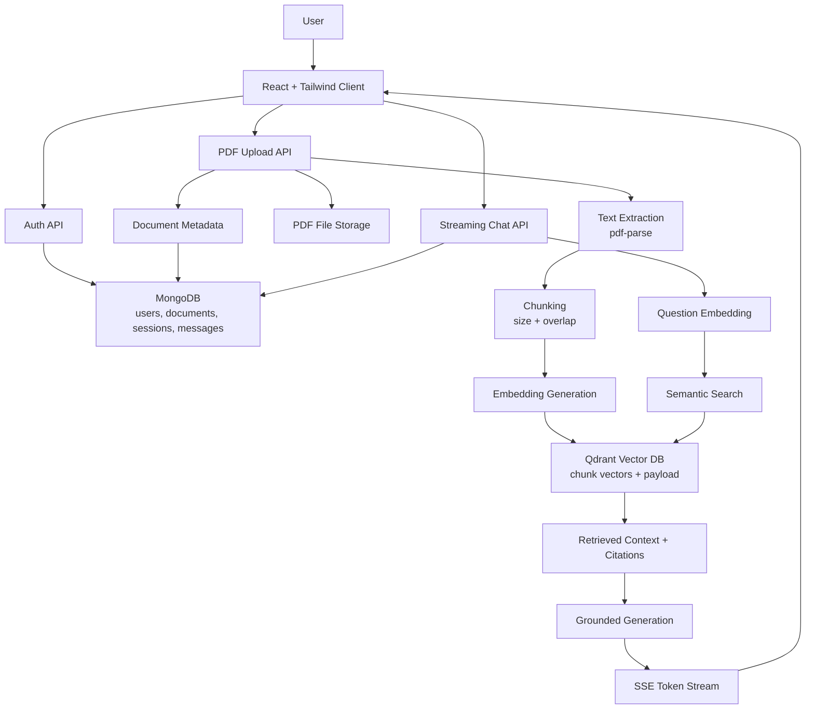

# Architecture

The application follows a strict RAG flow. The chat endpoint never sends a user question directly to generation without first retrieving indexed PDF chunks.

## Data Model

- `User`: name, email, password hash.
- `Document`: owner, original filename, storage path, status, page count, chunk count, errors.
- `ChatSession`: owner, title, messages.
- `Message`: role, content, citations.
- Qdrant payload: user id, document id, document title, chunk index, chunk text.

## Retrieval Rules

- Chat is blocked until the user has at least one indexed PDF.
- Retrieval is filtered by `userId`, so users only search their own documents.
- Answers are generated from retrieved context only.
- Citations include document title and chunk number.

## Chunking Strategy

The server normalizes whitespace and targets chunks around 1100 characters with 180 characters of overlap. This keeps chunks large enough for useful context while preserving continuity across section boundaries.

## Development AI Fallback

When `OPENAI_API_KEY` is missing, the app uses deterministic hashed embeddings and a grounded extractive response. This keeps the full RAG pipeline testable locally without a paid API key. Production deployments should set `OPENAI_API_KEY`.
